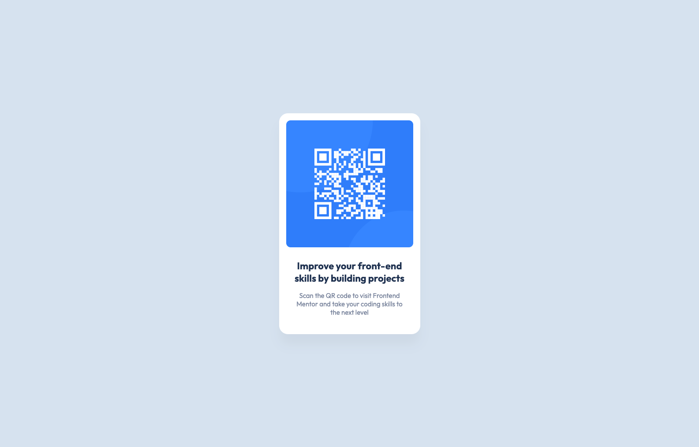

# Frontend Mentor - QR code component solution

This is a solution to the [QR code component challenge on Frontend Mentor](https://www.frontendmentor.io/challenges/qr-code-component-iux_sIO_H). Frontend Mentor challenges help you improve your coding skills by building realistic projects.

## Table of contents

- [Overview](#overview)
  - [Screenshot](#screenshot)
  - [Links](#links)
- [My process](#my-process)
  - [Built with](#built-with)
  - [Useful resources](#useful-resources)
- [Author](#author)

## Overview

### Screenshot

### Links

- Solution URL: (https://github.com/HerveWabo/QR-code-component-challenge.git)
- Live Site URL:(https://hervewabo.github.io/QR-code-component-challenge/)

## My process

### Built with

- Semantic HTML5 markup
- CSS custom properties
- Flexbox
- Mobile-first workflow

## Author

- Website - [Herve Wabo](https://www.your-site.com)
- Frontend Mentor - [@HerveWabo](https://www.frontendmentor.io/profile/HerveWabo)
- Twitter - [@iamhervewabo](https://www.twitter.com/iamhervewabo)
- Instagram - [@iamhervewabo](https://www.instagram.com/@iamhervewabo)
